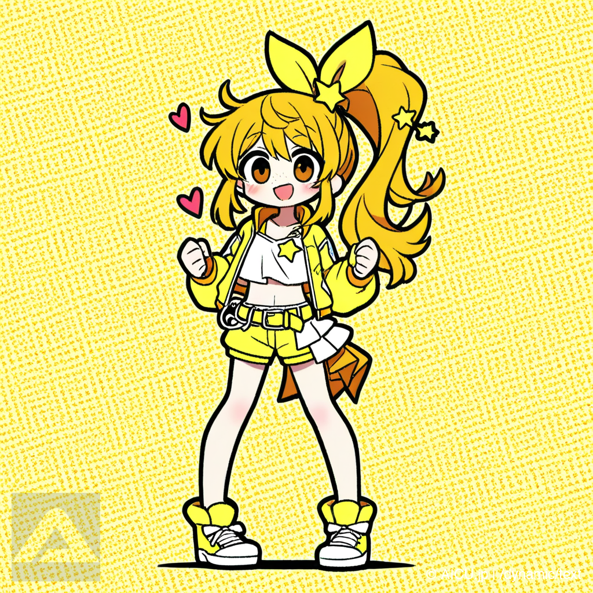
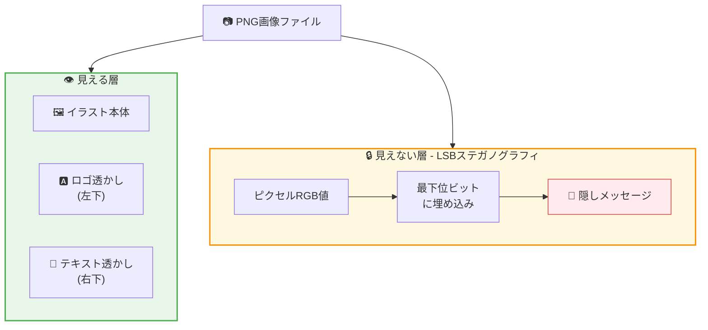
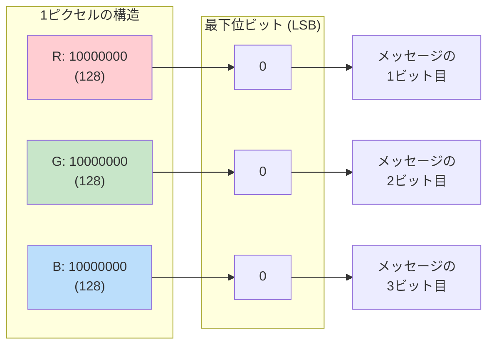
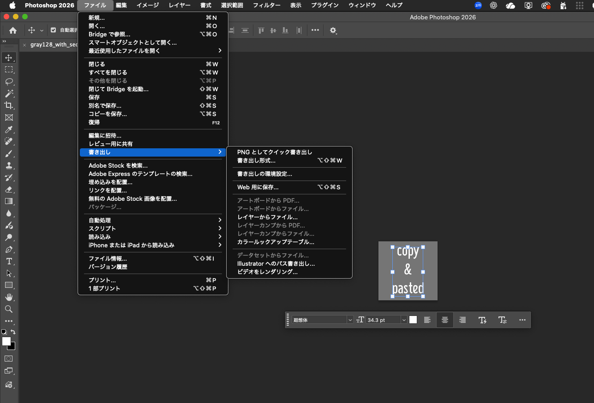
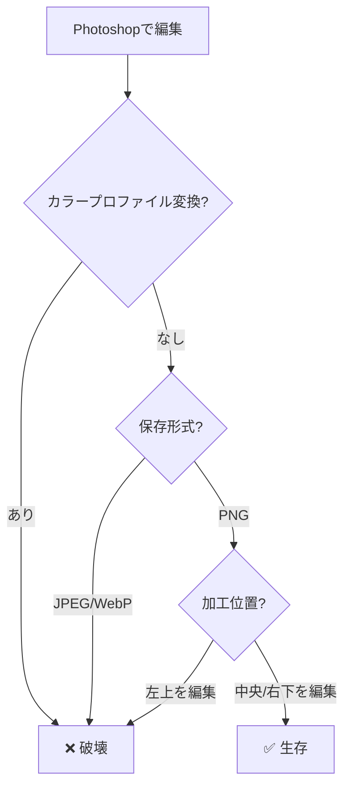

# ComfyUI Save Image with Watermark 💧

透かし（ウォーターマーク）機能付き画像保存カスタムノード for ComfyUI

## 🎨 この画像には秘密が隠されています





> 💡 **実際に試してみよう！**
> ```bash
> cd examples
> python3 -m venv venv && source venv/bin/activate && pip install Pillow
> python lsb_demo.py aicuty_000011.png
> # → "invisible Hello World!" が抽出されます！
> ```

## 機能

### 画像ロゴ透かし
- **MASK対応**: LoadImageのMASK出力を使用した正確なアルファブレンディング
- **透明PNG対応**: 黒浮き・白浮きなしの合成
- **位置・スケール・透明度**: 細かく調整可能

### テキスト透かし
- **カスタムテキスト**: フォントサイズ、色、透明度、位置を指定可能
- **動的テキスト**: 外部ノードからseed等を埋め込み可能
- **タイル配置**: 画像全体に繰り返しパターンで配置

### 不可視透かし（ステガノグラフィ）
- **LSB埋め込み**: 画像の最下位ビットに隠しメッセージを埋め込み
- **抽出ノード**: 埋め込まれた隠しメッセージを抽出

### メタデータ・来歴
- **ワークフロー埋め込み**: ComfyUI Core互換のワークフロー保存
- **コンテンツハッシュ**: SHA-256ハッシュを生成（ブロックチェーン来歴記録用）
- **AICU独自メタデータ**: 透かし情報、タイムスタンプ等

### 保存オプション
- **output_folder**: ComfyUIのoutputフォルダに保存
- **browser_download**: ブラウザでダウンロード
- **both**: 両方（デフォルト）

## インストール

### ComfyUI Manager経由
1. ComfyUI Managerを開く
2. "Install Custom Nodes"を選択
3. "comfyui-save-image-watermark"を検索
4. インストール

### 手動インストール
```bash
cd ComfyUI/custom_nodes
git clone https://github.com/aicuai/comfyui-save-image-watermark.git
```

## ノード一覧

### Save Image (Watermark) 💧
カテゴリ: `AICU/Save`

透かし付きで画像を保存するメインノード。

### Extract Hidden Watermark 🔍
カテゴリ: `AICU/Watermark`

不可視透かし（ステガノグラフィ）を抽出するノード。

## 処理順序

```
1. 画像ロゴ透かし（最下層）
   └─ MASK領域のみopacityでブレンド

2. テキスト透かし（ロゴの上）
   └─ 動的テキストと結合

3. 不可視透かし（最後）
   └─ LSBステガノグラフィ

4. ファイル保存
```

## パラメータ

### 基本設定
| パラメータ | 説明 | デフォルト |
|-----------|------|-----------|
| images | 入力画像 (IMAGE) | 必須 |
| filename_prefix | ファイル名プレフィックス | "aicuty" |
| file_format | PNG / JPEG / WEBP | PNG |
| save_to | output_folder / browser_download / both | both |

### 画像ロゴ透かし
| パラメータ | 説明 | デフォルト |
|-----------|------|-----------|
| watermark_image | ロゴ画像 (IMAGE) | - |
| watermark_image_mask | アルファマスク (MASK) | - |
| watermark_image_position | 位置 | bottom_left |
| watermark_image_scale | スケール (0.01-1.0) | 0.15 |
| watermark_image_opacity | 透明度 (0.0-1.0) | 1.0 |

### テキスト透かし
| パラメータ | 説明 | デフォルト |
|-----------|------|-----------|
| watermark_text | 透かしテキスト | "© AICU" |
| watermark_text_enabled | 有効/無効 | True |
| watermark_text_position | 位置 | bottom_right |
| watermark_text_opacity | 透明度 | 0.9 |
| watermark_text_size | フォントサイズ | 24 |
| watermark_text_color | 色（HEX） | #FFFFFF |
| dynamic_text | 動的テキスト入力 | - |

### 不可視透かし
| パラメータ | 説明 | デフォルト |
|-----------|------|-----------|
| invisible_watermark | 隠しメッセージ | "" |
| invisible_watermark_enabled | 有効/無効 | False |

### メタデータ
| パラメータ | 説明 | デフォルト |
|-----------|------|-----------|
| embed_workflow | ワークフロー埋め込み | True |
| embed_metadata | AICU メタデータ埋め込み | True |
| metadata_json | カスタムJSON | "{}" |

### 品質設定
| パラメータ | 説明 | デフォルト |
|-----------|------|-----------|
| jpeg_quality | JPEG品質 | 95 |
| webp_quality | WebP品質 | 90 |

### 位置オプション
- `bottom_right`: 右下
- `bottom_left`: 左下
- `top_right`: 右上
- `top_left`: 左上
- `center`: 中央
- `tile`: タイル状に繰り返し

## 使用例

### 基本的な使い方
```
[VAEDecode] → [Save Image (Watermark) 💧]
                    ↑
[LoadImage] → IMAGE + MASK
```

### 画像ロゴ + テキストの配置
```
LoadImage (ロゴ)
    ├─ IMAGE → watermark_image
    └─ MASK  → watermark_image_mask

設定:
- watermark_image_position: bottom_left (ロゴは左下)
- watermark_text_position: bottom_right (テキストは右下)
```

### 動的テキスト（seed表示）
```
[String] "/seed: 12345" → dynamic_text

結果: "© AICU/seed: 12345"
```
※ watermark_text と dynamic_text は区切り文字なしで連結されます

### 不可視透かしの埋め込みと抽出
```
埋め込み:
invisible_watermark = "secret message"
invisible_watermark_enabled = True

抽出:
[LoadImage] → [Extract Hidden Watermark 🔍] → hidden_message
```

## 出力

- **image**: 処理後の画像 (IMAGE) - 後続ノードへの接続用
- **filename**: 保存されたファイル名
- **content_hash**: SHA-256ハッシュ値（来歴記録用）

## 技術仕様

### 画像ロゴブレンディング
- MASKが0の部分: 完全透明（ブレンドしない）
- MASKが255の部分: opacity値でブレンド
- 計算式: `result = base * (1 - mask * opacity) + logo * (mask * opacity)`

### 不可視透かし（LSB）

現在の実装は**シンプルLSB（Least Significant Bit）方式**を採用しています。

#### LSBとは？



```
例: "H" (ASCII 72 = 01001000) を埋め込む

元のピクセル        埋め込み後          変化
─────────────────────────────────────────────
Pixel[0]
  R: 128 (10000000) → 128 (1000000[0])   LSB=0 ✓
  G: 128 (10000000) → 129 (1000000[1])   LSB=1 ← 変更！
  B: 128 (10000000) → 128 (1000000[0])   LSB=0 ✓

Pixel[1]
  R: 128 (10000000) → 128 (1000000[0])   LSB=0 ✓
  G: 128 (10000000) → 129 (1000000[1])   LSB=1 ← 変更！
  ...

128 → 129 の変化は人間の目には見えない！
```

> 💡 **実際に試す**: `python examples/lsb_demo.py --create-gray`

#### アルゴリズム

**埋め込み処理:**
1. メッセージをUTF-8でバイト列に変換
2. 終端マーカー（4つのNULLバイト `\x00\x00\x00\x00`）を追加
3. 各バイトを8ビットに分解
4. 画像の各ピクセルのR, G, B値の最下位ビット（LSB）を順番に書き換え
5. アルファチャンネル（透明度）は変更しない

**抽出処理:**
1. 画像の各ピクセルのR, G, B値からLSBを順番に取得
2. 8ビットずつ集めてバイトに復元
3. 終端マーカー（4つの連続NULLバイト）を検出したら終了
4. バイト列をUTF-8でデコードしてメッセージを復元

#### 仕様
- 最大埋め込み容量: `(width × height × 3) / 8` バイト
- 終端マーカー: 4バイト（`\x00\x00\x00\x00`）
- エンコーディング: UTF-8

#### ⚠️ 重要な制限事項

**この方式は画像加工に対して脆弱です。以下の操作でデータが破壊されます:**

| 操作 | 影響 |
|-----|------|
| JPEG保存 | ❌ 完全に破壊（非可逆圧縮がLSBを変更） |
| WebP保存（非可逆） | ❌ 完全に破壊 |
| リサイズ | ❌ 完全に破壊（ピクセル補間でLSBが変更） |
| クロップ | ❌ 完全に破壊（ピクセル位置がずれる） |
| 回転 | ❌ 完全に破壊 |
| 色調補正 | ❌ 完全に破壊 |
| PNG再保存 | ✅ 保持される（可逆圧縮のため） |

**推奨事項:**
- 不可視透かしを使用する場合は**PNG形式のみ**で保存してください
- 抽出前に画像を加工しないでください
- 耐久性が必要な場合は、将来実装予定のDCT/DWT方式をお待ちください

#### セキュリティ上の注意
- 現在の実装には**暗号化機能がありません**
- 埋め込み位置は**固定パターン**（左上から順番）
- 第三者が同じアルゴリズムで抽出可能です
- 機密情報の埋め込みには適しません

### コンテンツハッシュ
- アルゴリズム: SHA-256
- 入力: PNG形式でエンコードされた画像バイト列
- 出力: 64文字の16進数文字列

---

## 実験: Photoshopで加工してもLSBは生き残るか？

LSBステガノグラフィは「画像加工に弱い」と言われますが、実際にPhotoshopで編集した場合どうなるのか実験してみました。

### 実験環境

- Adobe Photoshop 2026
- macOS
- 元画像: 128x128 グレー画像（LSBに "Hello LSB!" を埋め込み済み）

### 実験手順

1. LSB埋め込み済みの画像をPhotoshopで開く
2. テキストツールで文字を追加
3. **「PNGとしてクイック書き出し」** で保存



### 結果

```
【ピクセル分析】
   最初の変更ピクセル: 行13, 列43（テキスト部分のみ）
   変更されたピクセル: 9.2%（テキスト領域のみ）

【LSBメッセージ領域】
   位置: 行0, 列0〜37（最初の38ピクセル）
   状態: 完全に無傷 ✅

【抽出テスト】
   元画像:           'Hello LSB!'
   Photoshop加工後:  'Hello LSB!'

   🎉 復号成功！
```

### なぜ成功したのか

| 要因 | 説明 |
|------|------|
| **書き出し方式** | 「PNGとしてクイック書き出し」は最適化が最小限 |
| **カラープロファイル** | 変換なし（埋め込みプロファイルを維持） |
| **加工位置** | テキストが中央、LSBデータは左上 → 重ならない |
| **ファイル形式** | PNG（可逆圧縮）で保存 |

### 生存条件まとめ



### 破壊されるケース

以下の操作を行うと確実に破壊されます：

- ❌ 「Web用に保存（従来）」→ 最適化でピクセル値が変わる
- ❌ 「書き出し形式」でJPEG選択
- ❌ カラープロファイルを変換（sRGB → Adobe RGB など）
- ❌ 画像サイズを変更（リサイズ）
- ❌ 左上領域にテキストやスタンプを追加

### 実験用スクリプト

自分で試してみたい場合は、以下のコマンドを実行してください：

```bash
cd examples

# Python環境のセットアップ
python3 -m venv venv
source venv/bin/activate  # Windows: venv\Scripts\activate
pip install Pillow

# グレー画像でLSB実験
python lsb_demo.py --create-gray

# 生成されたファイル
# - gray128_128x128.png        (元のグレー画像)
# - gray128_with_secret.png    (LSB埋め込み済み)

# Photoshopで gray128_with_secret.png を開いて加工し、
# 別名で保存してから抽出テスト
python lsb_demo.py your_edited_image.png
```

### 結論

> LSBステガノグラフィは思ったより丈夫...だが、信頼してはいけない

「PNG再保存なら大丈夫」という単純な話ではなく、**どこを編集したか**が重要です。
ただし、これはセキュリティ機能ではなく、あくまで**実験的な透かし**として使用してください。

---

## 将来の拡張予定

### テキスト装飾
- カスタムフォント対応
- 縁取り（ストローク）
- ドロップシャドウ
- テキスト回転
- 背景ボックス

### 高度なステガノグラフィ
- DCT (Discrete Cosine Transform) 方式
- DWT (Discrete Wavelet Transform) 方式
- 暗号化キーによる位置シャッフル
- エラー訂正符号

### その他
- ロゴ回転・ブレンドモード
- C2PA署名対応

## ライセンス

Apache License 2.0

## 関連プロジェクト

- [ComfyUI Master Guide](https://j.aicu.ai/comfysb)
- [comfyui-save-image-local](https://github.com/yhayano-ponotech/comfyui-save-image-local) - オリジナルの保存ノード
- [C2PA](https://c2pa.org/) - Content Credentials標準

## 貢献

Issue、Pull Requestを歓迎します。

## 作者

AICU Japan K. K.
- Web: https://aicu.jp
- GitHub: https://github.com/aicuai
