[English] | [日本語](README.ja.md)

---

# ComfyUI Save Image with Watermark 💧

Custom node for ComfyUI with watermarking capabilities

## 🎨 This Image Has a Secret

```mermaid
graph TB
    subgraph visible["👁️ Visible Layer"]
        direction LR
        V1["🖼️ Main Image"]
        V2["🅰️ Logo Watermark<br/>(bottom-left)"]
        V3["📝 Text Watermark<br/>(bottom-right)"]
    end

    subgraph invisible["🔒 Invisible Layer - LSB Steganography"]
        direction LR
        I1["Pixel RGB Values"]
        I2["Embedded in<br/>Least Significant Bit"]
        I3["🔐 Hidden Message"]
        I1 --> I2 --> I3
    end

    IMG["📷 PNG Image File"]
    IMG --> visible
    IMG --> invisible

    style visible fill:#e8f5e9,stroke:#4caf50,stroke-width:2px
    style invisible fill:#fff8e1,stroke:#ff8f00,stroke-width:2px
    style I3 fill:#ffebee,stroke:#e53935
```




> 💡 **Try it yourself!**
> ```bash
> cd examples
> python3 -m venv venv && source venv/bin/activate && pip install Pillow
> python lsb_demo.py aicuty_000011.png
> # → Extracts "invisible Hello World!"
> ```

## Features

### Image Logo Watermark
- **MASK Support**: Accurate alpha blending using LoadImage's MASK output
- **Transparent PNG Support**: No black/white bleeding in compositing
- **Position, Scale, Opacity**: Fine-grained control

### Text Watermark
- **Custom Text**: Configurable font size, color, opacity, position
- **Dynamic Text**: Embed seed values etc. from external nodes
- **Tile Mode**: Repeat pattern across entire image

### Invisible Watermark (Steganography)
- **LSB Embedding**: Hide messages in the least significant bits
- **Extraction Node**: Extract embedded hidden messages

### Metadata & Provenance
- **Workflow Embedding**: ComfyUI Core compatible workflow saving
- **Content Hash**: Generate SHA-256 hash for blockchain provenance
- **AICU Metadata**: Watermark info, timestamps, etc.

### Save Options
- **output_folder**: Save to ComfyUI output folder
- **browser_download**: Download via browser
- **both**: Both (default)

## Installation

### Via ComfyUI Manager (Recommended)

1. Launch ComfyUI
2. Click **Manager** button
3. Select **Install Custom Nodes**
4. Search for `watermark` or `aicu`
5. Find **comfyui-save-image-watermark** and click **Install**
6. Restart ComfyUI


### Via Comfy Registry

```bash
comfy node registry-install comfyui-save-image-watermark
```

### Manual Installation

```bash
cd ComfyUI/custom_nodes
git clone https://github.com/aicuai/comfyui-save-image-watermark.git
```

### Dependencies

This node uses only ComfyUI's standard libraries, no additional dependencies required.

- Pillow (bundled with ComfyUI)
- NumPy (bundled with ComfyUI)
- PyTorch (bundled with ComfyUI)

## Node List

### Save Image (Watermark) 💧
Category: `AICU/Save`

Main node for saving images with watermarks.

### Extract Hidden Watermark 🔍
Category: `AICU/Watermark`

Node for extracting invisible watermarks (steganography).

---

## How to Use in ComfyUI

### Adding the Node

1. Right-click on canvas → **Add Node**
2. Select **AICU** → **Save** → **Save Image (Watermark) 💧**

### Node Wiring Diagram


### Basic Connections

#### Step 1: Connect Source Image

Connect your generated image to the `images` pin.

```
[KSampler] → [VAEDecode] → images
```


#### Step 2: Connect Logo Image (Optional)

To add a logo watermark, connect two wires from LoadImage node.

```
[LoadImage]
    ├─ IMAGE → watermark_image
    └─ MASK  → watermark_image_mask  ← Important! Alpha info
```

> ⚠️ **Don't forget MASK!** Without MASK, transparent areas will appear black.


#### Step 3: Configure Parameters

Adjust settings using the node's widgets.


### Input Pins (Left Side)

| Pin Name | Type | Required | Description |
|----------|------|----------|-------------|
| **images** | IMAGE | ✅ | Source image. Connect VAEDecode output |
| **watermark_image** | IMAGE | - | Logo image. Connect LoadImage IMAGE output |
| **watermark_image_mask** | MASK | - | Logo alpha. Connect LoadImage MASK output |
| **dynamic_text** | STRING | - | Dynamic text. Can connect seed values etc. |

### Output Pins (Right Side)

| Pin Name | Type | Description |
|----------|------|-------------|
| **image** | IMAGE | Processed image. Can connect to subsequent nodes |
| **filename** | STRING | Saved filename |
| **content_hash** | STRING | SHA-256 hash (for provenance) |

---

### Parameter Details

#### Basic Settings

| Parameter | Type | Default | Description |
|-----------|------|---------|-------------|
| `filename_prefix` | STRING | "aicuty" | Filename prefix. Numbered like `aicuty_00001_.png` |
| `file_format` | ENUM | PNG | Save format. **PNG recommended** (preserves LSB) |
| `save_to` | ENUM | both | Destination. `output_folder` / `browser_download` / `both` |

#### Image Logo Watermark

| Parameter | Type | Default | Description |
|-----------|------|---------|-------------|
| `watermark_image_position` | ENUM | bottom_left | Logo position |
| `watermark_image_scale` | FLOAT | 0.15 | Logo ratio to image width (1%-100%) |
| `watermark_image_opacity` | FLOAT | 1.0 | Opacity (0.0=transparent, 1.0=opaque) |

#### Text Watermark

| Parameter | Type | Default | Description |
|-----------|------|---------|-------------|
| `watermark_text` | STRING | "© AICU" | Watermark text |
| `watermark_text_enabled` | BOOL | True | Enable/disable text watermark |
| `watermark_text_position` | ENUM | bottom_right | Text position |
| `watermark_text_opacity` | FLOAT | 0.9 | Opacity |
| `watermark_text_size` | INT | 24 | Font size (8-128px) |
| `watermark_text_color` | STRING | #FFFFFF | Text color (HEX format) |

#### Invisible Watermark (LSB)

| Parameter | Type | Default | Description |
|-----------|------|---------|-------------|
| `invisible_watermark` | STRING | "" | Secret message to embed |
| `invisible_watermark_enabled` | BOOL | False | Enable/disable invisible watermark |

> ⚠️ **Note**: Invisible watermarks are preserved **only in PNG format**. JPEG/WebP will destroy them.

#### Metadata

| Parameter | Type | Default | Description |
|-----------|------|---------|-------------|
| `embed_workflow` | BOOL | True | Embed ComfyUI workflow |
| `embed_metadata` | BOOL | True | Embed AICU metadata |
| `metadata_json` | STRING | "{}" | Custom JSON metadata |

#### Quality Settings

| Parameter | Type | Default | Description |
|-----------|------|---------|-------------|
| `jpeg_quality` | INT | 95 | JPEG quality (1-100) |
| `webp_quality` | INT | 90 | WebP quality (1-100) |

---

### Position Options

```
┌────────────────────────────────────────┐
│ top_left          top_right            │
│    ◆                    ◆              │
│                                        │
│              center                    │
│                 ◆                      │
│                                        │
│    ◆                    ◆              │
│ bottom_left      bottom_right          │
└────────────────────────────────────────┘

tile: Repeat pattern across entire image
```

---

### Extract Hidden Watermark 🔍 Node

Node for extracting LSB steganography messages.


#### Input Pins

| Pin Name | Type | Description |
|----------|------|-------------|
| **image** | IMAGE | Image to extract from |

#### Parameters

| Parameter | Type | Default | Description |
|-----------|------|---------|-------------|
| `max_length` | INT | 1000 | Maximum characters to read |

#### Output Pins

| Pin Name | Type | Description |
|----------|------|-------------|
| **hidden_message** | STRING | Extracted message |

#### Usage Example

```
[LoadImage] ──IMAGE──→ [Extract Hidden Watermark 🔍] ──STRING──→ [ShowText]
```


---

## Processing Order

```
1. Image Logo Watermark (bottom layer)
   └─ Blend only in MASK areas with opacity

2. Text Watermark (above logo)
   └─ Combined with dynamic text

3. Invisible Watermark (last)
   └─ LSB Steganography

4. File Save
```

---

## Technical Specifications

### Image Logo Blending
- MASK=0: Fully transparent (no blending)
- MASK=255: Blend with opacity value
- Formula: `result = base * (1 - mask * opacity) + logo * (mask * opacity)`

### Invisible Watermark (LSB)

This implementation uses **simple LSB (Least Significant Bit) method**.

#### What is LSB?


```
Example: Embedding "H" (ASCII 72 = 01001000)

Original Pixel      After Embedding     Change
─────────────────────────────────────────────
Pixel[0]
  R: 128 (10000000) → 128 (1000000[0])   LSB=0 ✓
  G: 128 (10000000) → 129 (1000000[1])   LSB=1 ← Changed!
  B: 128 (10000000) → 128 (1000000[0])   LSB=0 ✓

The 128 → 129 change is invisible to human eyes!
```

> 💡 **Try it**: `python examples/lsb_demo.py --create-gray`

#### Algorithm

**Embedding Process:**
1. Convert message to UTF-8 byte sequence
2. Add termination marker (4 NULL bytes `\x00\x00\x00\x00`)
3. Split each byte into 8 bits
4. Overwrite LSB of each pixel's R, G, B values sequentially
5. Alpha channel (transparency) is not modified

**Extraction Process:**
1. Get LSB from each pixel's R, G, B values sequentially
2. Collect 8 bits to reconstruct bytes
3. Stop when termination marker (4 consecutive NULL bytes) is detected
4. Decode byte sequence as UTF-8 to recover message

#### Specifications
- Maximum capacity: `(width × height × 3) / 8` bytes
- Termination marker: 4 bytes (`\x00\x00\x00\x00`)
- Encoding: UTF-8

#### ⚠️ Important Limitations

**This method is vulnerable to image processing. The following operations will destroy data:**

| Operation | Effect |
|-----------|--------|
| JPEG save | ❌ Completely destroyed (lossy compression changes LSB) |
| WebP save (lossy) | ❌ Completely destroyed |
| Resize | ❌ Completely destroyed (pixel interpolation changes LSB) |
| Crop | ❌ Completely destroyed (pixel positions shift) |
| Rotation | ❌ Completely destroyed |
| Color adjustment | ❌ Completely destroyed |
| PNG re-save | ✅ Preserved (lossless compression) |

**Recommendations:**
- Use **PNG format only** when using invisible watermarks
- Do not process the image before extraction
- For robustness, wait for future DCT/DWT implementation

#### Security Notice
- Current implementation has **no encryption**
- Embedding position is **fixed pattern** (sequential from top-left)
- Third parties can extract using the same algorithm
- Not suitable for embedding confidential information

### Content Hash
- Algorithm: SHA-256
- Input: Image byte sequence encoded as PNG
- Output: 64-character hexadecimal string

---

## Experiment: Does LSB Survive Photoshop Editing?

LSB steganography is said to be "vulnerable to image processing", but what actually happens when editing with Photoshop?

### Test Environment

- Adobe Photoshop 2026
- macOS
- Source: 128x128 gray image (with "Hello LSB!" embedded via LSB)

### Procedure

1. Open LSB-embedded image in Photoshop
2. Add text using text tool
3. Save with **"Quick Export as PNG"**


### Results

```
【Pixel Analysis】
   First changed pixel: Row 13, Column 43 (text area only)
   Changed pixels: 9.2% (text area only)

【LSB Message Area】
   Location: Row 0, Columns 0-37 (first 38 pixels)
   Status: Completely intact ✅

【Extraction Test】
   Original:        'Hello LSB!'
   After Photoshop: 'Hello LSB!'

   🎉 Decoding successful!
```

### Why It Survived

| Factor | Explanation |
|--------|-------------|
| **Export method** | "Quick Export as PNG" has minimal optimization |
| **Color profile** | No conversion (embedded profile maintained) |
| **Edit location** | Text in center, LSB data in top-left → no overlap |
| **File format** | Saved as PNG (lossless) |

### Survival Conditions

```mermaid
flowchart TD
    A[Edit in Photoshop] --> B{Color profile conversion?}
    B -->|Yes| X[❌ Destroyed]
    B -->|No| C{Save format?}
    C -->|JPEG/WebP| X
    C -->|PNG| D{Edit location?}
    D -->|Top-left edited| X
    D -->|Center/bottom-right| E[✅ Survives]
```



### Conclusion

> LSB steganography is more durable than expected... but don't trust it

It's not simply "PNG re-save is OK" - **where you edit** matters.
However, this is not a security feature - use only as an **experimental watermark**.

---

## Future Plans

### Text Decoration
- Custom font support
- Stroke (outline)
- Drop shadow
- Text rotation
- Background box

### Advanced Steganography
- DCT (Discrete Cosine Transform) method
- DWT (Discrete Wavelet Transform) method
- Position shuffling with encryption key
- Error correction codes

### Other
- Logo rotation & blend modes
- C2PA signature support

## License

Apache License 2.0

## Related Projects

- [ComfyUI Master Guide](https://j.aicu.ai/comfysb)
- [comfyui-save-image-local](https://github.com/yhayano-ponotech/comfyui-save-image-local) - Original save node
- [C2PA](https://c2pa.org/) - Content Credentials standard

## Contributing

Issues and Pull Requests are welcome.

## Author

AICU Japan K. K.
- Web: https://aicu.jp
- GitHub: https://github.com/aicuai
